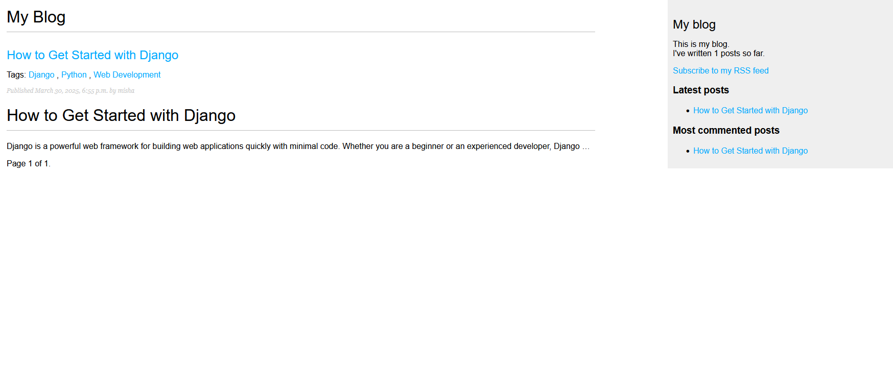
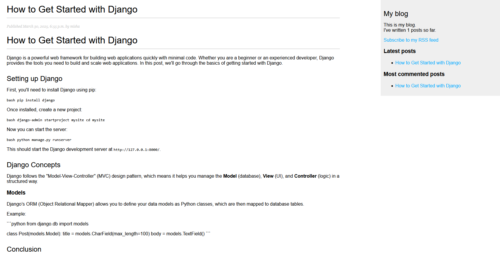
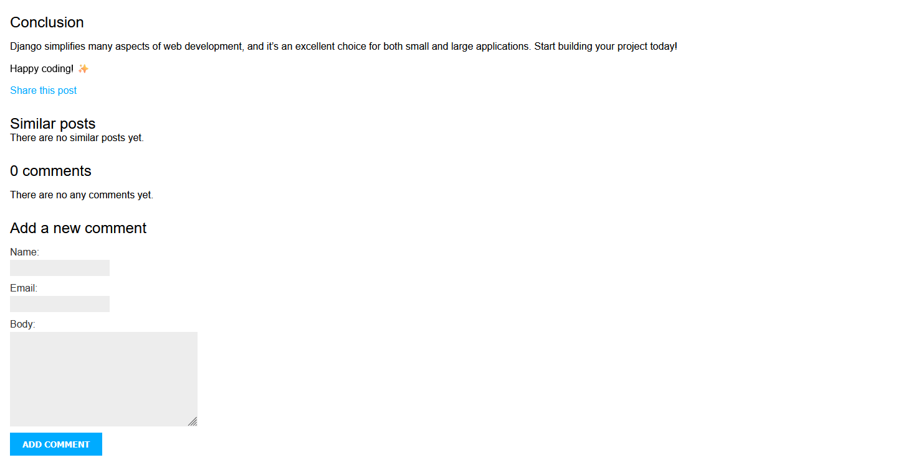

# Django Blog App 📝

Welcome to the Django Blog App! This project is a simple blogging platform built using Django, where users can create, edit, and delete blog posts. It also supports categories, tags, and Markdown for writing posts.

## Features ✨

- **CRUD Operations**: Create, Read, Update, and Delete blog posts.

- **Markdown Support**: Write posts in Markdown format, with rendering.

- **Categories and Tags**: Organize posts by categories and tags.
- **Admin Panel**: Manage posts, categories, and users from the Django admin panel.

---

## Installation 🛠️

### Step 1: Set up a virtual environment

It’s highly recommended to use a virtual environment to avoid conflicts with global dependencies.

```bash
python -m venv venv
source venv/bin/activate  # For Windows use: venv\Scripts\activate
```

### Step 2: Install dependencies

Install all the required dependencies with pip:

```bash
pip install -r requirements.txt
```

### Step 3: Set up the database

Make sure to run migrations to set up the database schema:

```bash
python manage.py migrate
```

### Step 4: Create a superuser (for admin access)

Create a superuser to access the admin panel:

```bash
python manage.py createsuperuser
```

You’ll be prompted to enter a username, email, and password.

### Step 5: Run the development server

Start the server by running:

```bash
python manage.py runserver
```

You can now access the app at `http://127.0.0.1:8000/`.


## URLs 🌍

- `/`: Homepage displaying a list of all blog posts.
- `/posts/<slug>/`: Detailed view of a single blog post.
- `/admin/`: Django admin panel for managing posts, categories, and users.
- `/tags/<slug>/`: Filter posts by tag.
- `/categories/<slug>/`: Filter posts by category.
- `/create/`: Page for creating a new post (for logged-in users).

---

## 🔧 Technologies Used

- **Django**: Web framework
- **PostgreSQL**: Database management

